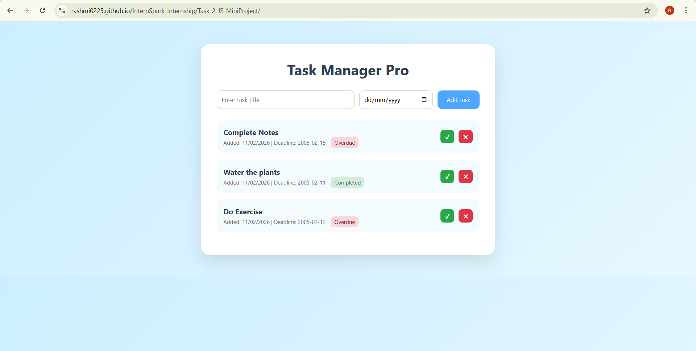

# Task 2 – Task Manager Pro

## Project Overview

Task Manager Pro is a mini interactive JavaScript application built using DOM manipulation.  
It allows users to add tasks, set deadlines, track status, and store data using localStorage.

This project was developed as part of the InternSpark Internship – Task 2.

---

## Features

- Add new tasks
- Set task deadline
- Auto display date added
- Mark tasks as Completed
- Overdue task detection
- Delete tasks
- Persistent storage using localStorage
- Clean and professional UI

---

## Technologies Used

- HTML5
- CSS3
- JavaScript (DOM Manipulation)
- LocalStorage API

---

## How It Works

- Tasks are created dynamically using JavaScript.
- Each task is stored in localStorage.
- On page reload, saved tasks are automatically loaded.
- Status is calculated based on:
  - Current Date
  - Deadline
  - Completion state

---

## Screenshots

---

## Live Demo

🔗 https://Rashmi0225.github.io/InternSpark-Internship/Task-2-JS-MiniProject/

---

## 👩‍💻 Developed By

Rashmi Pasi  
InternSpark Internship – 2026

