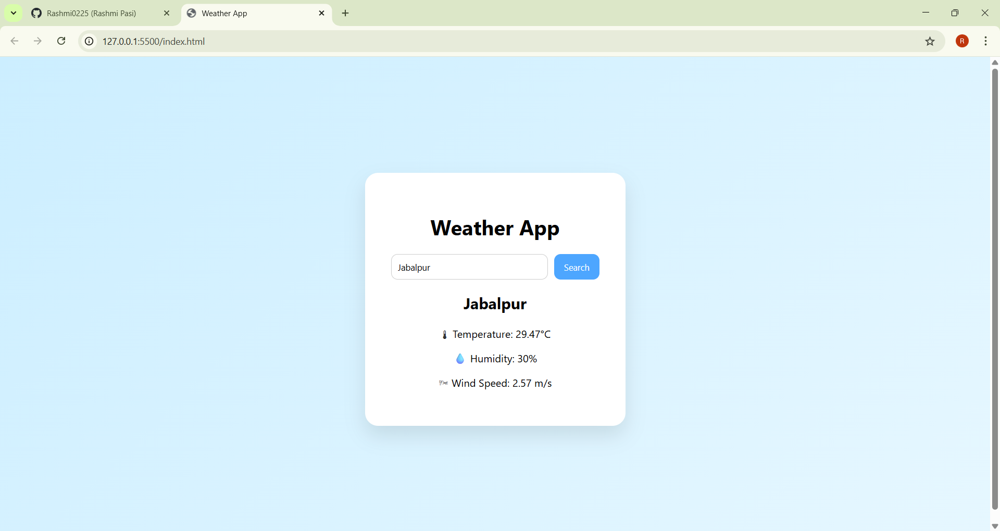

🌦 Weather App – API Integration Project  

## Project Description  

This project was developed as part of my **InternSpark Internship – Task 3 (API Integration Project)**.

The Weather App fetches real-time weather data from a public REST API and dynamically displays it on the webpage using JavaScript DOM manipulation. Users can search for any city and view its current weather details.

---

## Features  

- Search weather by city name  
- Real-time data fetching using Fetch API  
- Displays temperature, humidity, wind speed, and weather condition  
- Loading state while fetching data  
- Error handling for invalid city names  
- Responsive and clean user interface  

---

## API Used  

**OpenWeatherMap API**

- Type: Public REST API  
- Endpoint Used:  
  https://api.openweathermap.org/data/2.5/weather  
- Data Format: JSON  
- Integrated using JavaScript Fetch API  

---

## Live Demo  

🔗 https://Rashmi0225.github.io/InternSpark-Internship/Task-3-API-Integration/

---

## Technologies Used  

- HTML  
- CSS  
- JavaScript  
- Fetch API  
- GitHub Pages  

---

## Screenshot  

---

## Author  

Rashmi Pasi  
InternSpark Internship – Task 3  
